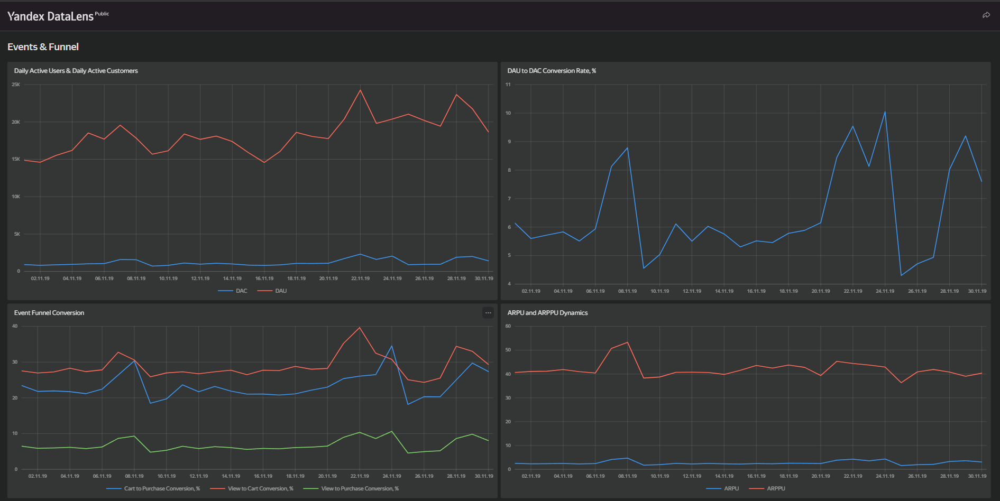
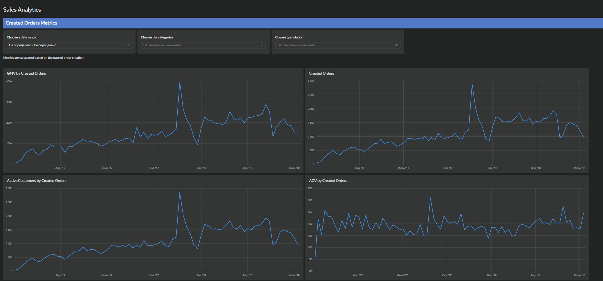
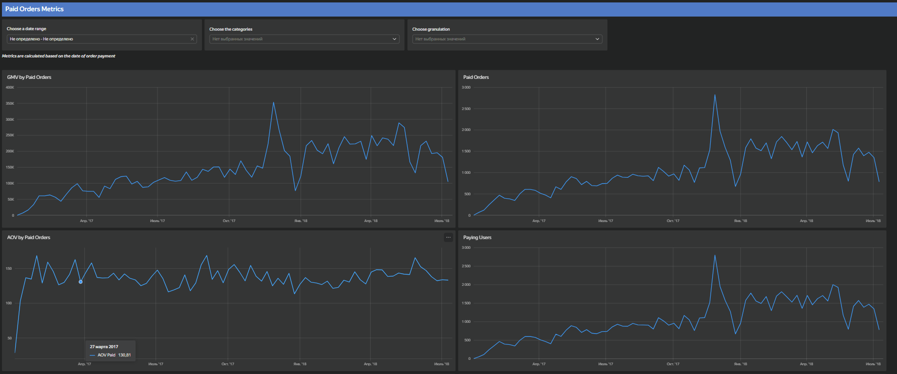
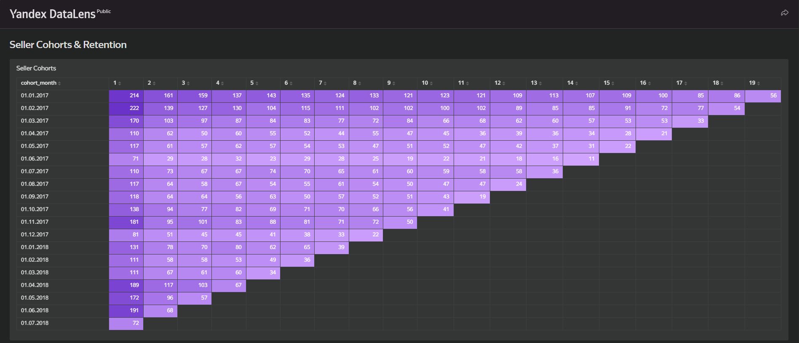
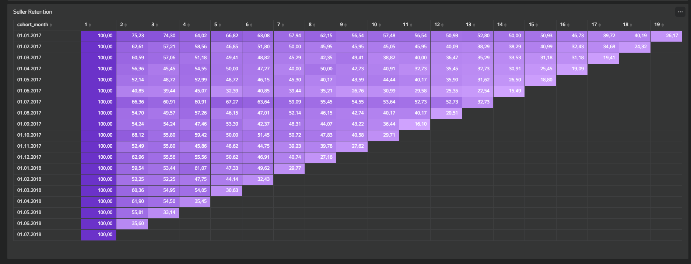

# Marketplace Analytics Dashboard

BI-дашборд для анализа ключевых метрик маркетплейса: продаж, пользовательской активности, воронки событий, монетизации и удержания продавцов.

## Описание проекта

Проект представляет собой интерактивный дашборд в Yandex DataLens.  
Цель проекта — собрать основные продуктовые и бизнес-метрики маркетплейса в одном месте и оценить динамику продаж, активность пользователей, конверсию воронки и retention продавцов.

## Инструменты

- Yandex DataLens
- SQL
- PostgreSQL
- GitHub

## Структура дашборда

### Events & Funnel

Раздел для анализа пользовательской активности и воронки.

Метрики:
- Daily Active Users
- Daily Active Customers
- DAU to DAC Conversion Rate
- View to Cart Conversion
- Cart to Purchase Conversion
- View to Purchase Conversion
- ARPU
- ARPPU

Важно: раздел Events & Funnel построен на данных пользовательских событий за ноябрь 2019 года.

### Sales Analytics

Раздел для анализа созданных и оплаченных заказов.

Метрики:
- GMV by Created Orders
- GMV by Paid Orders
- Created Orders
- Paid Orders
- AOV by Created Orders
- AOV by Paid Orders
- Paying Users
- Paid Orders Margin

### Seller Cohorts & Retention

Раздел для когортного анализа продавцов.

Метрики:
- Seller Cohorts
- Active Sellers
- Seller Retention
- GMV Created
- ARPPS Created

## Ссылки на дашборды

- [Events & Funnel](https://datalens.yandex/k7m2yeux53723)
- [Sales Analytics](https://datalens.yandex/j6ktthik5znw2)
- [Seller Cohorts & Retention](https://datalens.yandex/4r6j4vj32o66n)

## Скриншоты

### Events & Funnel

### Sales Analytics

### Seller Cohorts & Seller Retention

## Data Preparation

Для подготовки данных использовались SQL-запросы и вычисляемые поля Yandex DataLens.

### SQL-based datasets

| Файл | Описание |
|---|---|
| [events_funnel_metrics.sql](sql/events_funnel_metrics.sql) | Агрегация пользовательских событий за ноябрь 2019 года: sessions, DAU, users with view/cart/purchase и GMV created |
| [sellers_cohorts_retention.sql](sql/sellers_cohorts_retention.sql) | Когортный анализ продавцов: cohort month, purchase month, active sellers, seller retention, GMV и ARPPS |

### DataLens calculated datasets

- `created_orders_metrics` — метрики по созданным заказам: GMV, Orders, Active Customers, AOV
- `paid_orders_metrics` — метрики по оплаченным заказам: GMV, Orders, Paying Users, AOV, Margin

Часть метрик рассчитывалась с помощью вычисляемых полей Yandex DataLens, что позволило разделить подготовку данных между SQL-слоем и BI-слоем.

## Что было сделано

- Подготовил SQL-датасеты для воронки событий и когортного анализа продавцов.
- Собрал интерактивные BI-дашборды в Yandex DataLens.
- Разделил анализ на пользовательскую активность, продажи и retention продавцов.
- Рассчитал и визуализировал продуктовые и бизнес-метрики: DAU, конверсии, GMV, AOV, ARPU, ARPPU и retention.

## Основные выводы

### User Activity & Funnel

- Воронка пользователей показывает путь от просмотра товара до покупки: `view → cart → purchase`. Основные потери пользователей происходят между этапами просмотра товара и добавления в корзину, что является ключевой зоной для оптимизации пользовательского опыта.

- Метрики DAU и Daily Active Customers позволяют отслеживать уровень пользовательской активности и конверсию активных пользователей в покупателей.

- ARPPU значительно выше ARPU, что показывает, что основная часть выручки формируется за счёт пользователей, совершивших покупку.

### Sales Analytics

- Анализ Created Orders и Paid Orders позволяет разделить потенциальный спрос и фактически полученную выручку.

- GMV, количество заказов и средний чек (AOV) используются для оценки динамики продаж маркетплейса и изменения покупательской активности.

- Сравнение Created Orders и Paid Orders помогает выявлять возможные потери между созданием заказа и его оплатой.

### Seller Cohorts & Retention

- Когортный анализ позволяет оценить, как меняется активность продавцов после их первого месяца работы на платформе.

- Retention продавцов показывает долю продавцов, которые продолжают совершать продажи спустя несколько месяцев после первой активности.

- Метрики GMV и ARPPS позволяют оценить не только количество активных продавцов, но и их вклад в выручку маркетплейса.
